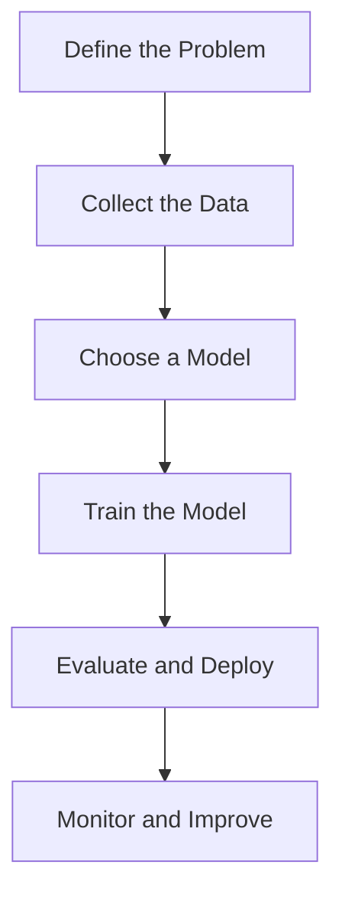

# AI Seminar for Automotive Experts

---
14:00-14:30 Introduction to AI & fundamental concepts​

14:30-14:50 Presentation Natural Language Processing (NLP) & Large Language Model (LLM)​

14:50-15:10 Computer Vision and Multimodality​

15:10-15:30 Data, Technical Documentation and Legacy Code​

15:30-15:50 AI applied to the automative industry​

15:50-16:00 Summary

---

Introduction to AI & fundamental concepts​

---
## AI VS GENERATIVE AI​
ARTIFICIAL INTELLIGENCE Artificial Intelligence is a field of computer science that aims to create systems capable of imitating or simulating human intelligence.​

MACHINE LEARNING Machine Learning focuses on building systems that learn and improve from experience without being explicitly programmed.​

DEEP LEARNING Deep Learning uses neural networks with many layers to model complex patterns in data.​

GENERATIVE AI Generative AI can create or generate new content, ideas, or data that resemble human creativity.​

---

## ML: Supervised Learning​

Using Labeled Data​

Classification and Regression Tasks​

---

## ML: Supervised Learning​
- Predictive maintenance for vehicle components (e.g., brake pads, tires).
- Driver behavior analysis and risk assessment.
- Traffic sign recognition and classification.
- Lane departure warning systems.

---

## ML: Unsupervised Learning​
Discovering hidden structures​

Clustering and dimensionality reduction techniques​

---
## ML: Unsupervised Learning​
- Clustering driver behavior patterns for personalized insurance plans.
- Grouping traffic patterns to optimize navigation and route planning.
- Segmenting vehicle usage data to design targeted marketing strategies.

---
## ML: Reinforcement Learning​
Agents learning through trial and error​

Reward systems​

### Video: Reinforcement Learning in Action

<iframe
  width="720"
  height="405"
  src="https://www.youtube.com/watch?v=spfpBrBjntg"
  frameborder="0"
  allowfullscreen>
</iframe>

---

## ML: Reinforcement Learning​
- Autonomous driving systems learning optimal driving strategies through simulation.
- Adaptive cruise control systems optimizing fuel efficiency and safety.
- Parking assistance systems learning to navigate complex parking scenarios.

---

| Mode            | Labeled Training Data | Definition                                                                                     | Use Cases                                                                                     |
|-----------------|-----------------------|------------------------------------------------------------------------------------------------|---------------------------------------------------------------------------------------------|
| Supervised      | YES                   | During the training phase, the desired outcome is known                                       | Image recognition, value prediction, diagnostics, fraud detection                          |
| Unsupervised    | NO                    | During the training phase, the desired outcome is unknown                                     | Customer segmentation, KPI determination, grouping objects that appear to share similarities |
| Reinforcement   | Depends               | The expected result is evaluated on a case-by-case basis                                      | Recommendation engines, AI in gaming                                                        |

---

## Biological Neurons  
Structure: dendrites, soma, axon  

Functioning of synapses  

Transmission of electrical signals  

---

### Artificial Neurons  
Mathematical model of the artificial neuron  

Activation functions: ReLU, Sigmoid, Tanh  

Similarities and differences with biological neurons?  

---
### Artificial Neural Networks

Artificial neural networks (ANNs) are computational models inspired by the structure and functioning of biological neural networks. They consist of interconnected layers of artificial neurons, where each neuron processes inputs, applies an activation function, and passes the output to the next layer. ANNs are widely used for tasks such as pattern recognition, classification, and regression in various domains.

### Parameters and Weights in Neural Networks

In neural networks, **parameters** refer to the adjustable values that the model learns during training. These include:

1. **Weights:**
  - Represent the strength of the connection between neurons.
  - Adjusted during training to minimize the error between predicted and actual outputs.

2. **Biases:**
  - Added to the weighted sum of inputs to shift the activation function.
  - Helps the model fit the data better by allowing flexibility in decision boundaries.

**Why They Matter:**
- Weights and biases are the core components that enable neural networks to learn patterns and make predictions. By iteratively updating these values using optimization algorithms like gradient descent, the network improves its performance on the given task.

**Example:**
- In a simple neural network, if the input is `x`, the weight is `w`, and the bias is `b`, the output of a neuron is calculated as:
  ```
  output = activation_function(w * x + b)
  ```

---

## Mistral 7B: Number of Parameters

  The Mistral 7B model is a state-of-the-art foundation model with **7 billion parameters**.

  **Comparison:**
  - **Mistral 7B:** 7 billion parameters.
  - **GPT-4:** Estimated 175 billion parameters.
  - **LLaMA 2 (13B):** 13 billion parameters.

---

### Multi-Layer Perceptron (MLP)

A Multi-Layer Perceptron (MLP) is a type of artificial neural network composed of an input layer, one or more hidden layers, and an output layer. Each layer consists of interconnected nodes (neurons) where inputs are processed through weighted connections, activation functions, and biases. MLPs are widely used for supervised learning tasks such as classification and regression, leveraging their ability to model complex, non-linear relationships in data.

The concept of the MLP was first introduced in 1969 by Marvin Minsky and Seymour Papert in their book *Perceptrons*, which laid the groundwork for neural network research.

--- 

### Backpropagation

Backpropagation, is a supervised learning algorithm used to train artificial neural networks. It adjusts the weights of the network by propagating the error from the output layer back to the input layer. The process involves two main steps:

1. **Forward Pass:** Compute the output of the network and the error by comparing the predicted output to the actual target.
2. **Backward Pass:** Calculate the gradient of the error with respect to each weight using the chain rule and update the weights to minimize the error.

This iterative process continues until the network converges to an optimal solution, making it a cornerstone of deep learning.

---
### Gradient Descent

Gradient Descent is an optimization algorithm used to minimize a function by iteratively moving in the direction of the steepest descent, as defined by the negative of the gradient. It is widely used in machine learning to optimize model parameters by reducing the error between predicted and actual values.

**Steps:**
1. Initialize parameters (e.g., weights) with random values.
2. Compute the gradient of the loss function with respect to the parameters.
3. Update the parameters by subtracting the gradient scaled by a learning rate.
4. Repeat until convergence or a stopping criterion is met.

**Key Concepts:**
- **Learning Rate:** Controls the step size in each iteration.
- **Convergence:** Achieved when the gradient approaches zero or the loss stops decreasing.

--- 

### Building an AI Model: Key Steps

Building an AI model involves several critical steps to ensure its effectiveness and reliability. Here's a concise overview:

1. **Define the Problem:**
  - Clearly identify the objective and the problem you want to solve.
  - Example: Predict brake pad wear or classify traffic signs.

2. **Collect the Data:**
  - Gather relevant and high-quality data for training and testing.
  - Example: Sensor data, images, or historical logs.

3. **Choose a Model:**
  - Select an appropriate algorithm or architecture based on the problem.
  - Example: Use YOLO for real-time object detection or LSTM for time-series predictions.

4. **Train the Model:**
  - Split the data into training, validation, and test sets.
  - Train the model using the training data and evaluate its performance on the validation set.
  - Fine-tune hyperparameters to optimize accuracy and generalization.

5. **Evaluate and Deploy:**
  - Test the model on unseen data to ensure robustness.
  - Deploy the model in the target environment (e.g., embedded systems, cloud).



---
### Quiz: Neural Networks

#### What is the primary advantage of using artificial neural networks (ANNs) in AI applications?
  - A) They are inspired by biological neurons.
  - B) They can model complex, non-linear relationships in data.
  - C) They require no training data.
  - D) They are faster than all other machine learning models.

#### What is the purpose of backpropagation in training neural networks?
  - A) To initialize the weights of the network.
  - B) To propagate the input data forward through the network.
  - C) To adjust the weights by minimizing the error using gradient descent.
  - D) To add more layers to the network.

#### What does the gradient descent algorithm aim to achieve in neural network training?
  - A) Maximize the loss function.
  - B) Minimize the loss function by iteratively updating the weights.
  - C) Increase the learning rate.
  - D) Reduce the number of neurons in the network.

#### Which of the following is a key advantage of using reinforcement learning in neural networks?
  - A) It requires labeled training data.
  - B) It learns optimal strategies through trial and error.
  - C) It is only applicable to supervised learning tasks.
  - D) It does not use reward systems.

---
### MNIST Dataset: Handwritten Digit Recognition

The MNIST (Modified National Institute of Standards and Technology) dataset is a widely used benchmark in machine learning and computer vision. It consists of 70,000 grayscale images of handwritten digits (0–9), each of size 28x28 pixels. The dataset is used to train and evaluate models for digit recognition tasks.

**Significance:**
- MNIST serves as a starting point for testing and comparing machine learning algorithms.
- It helps in understanding how neural networks can classify numbers based on pixel patterns.

**History:**
- MNIST was introduced in 1998 by Yann LeCun, Corinna Cortes, and Christopher J.C. Burges as part of their research on neural networks and machine learning.

**Applications:**
- Digit recognition in postal systems.
- Foundational experiments in deep learning.


<small>Example of handwritten digits recognition from the MNIST dataset</small>

---
### Tokenization

Tokens in natural language processing (NLP) are like syllables in poetry. Just as syllables are the building blocks of rhythm and structure in a poem, tokens are the fundamental units that allow AI models to process and understand text. 

#### Example:

"Winter is Coming" → 
-> 5 tokens
- **Syllables in a poem:** Win / ter / is / com / ing.
- **Tokens in NLP:** ["Win", "##ter", "is", "Com", "##ing"].

---
### Token in AI Models

The token limit defines the maximum number of tokens a model can process in a single input. Higher token limits enable handling longer contexts, making models more effective for tasks like summarization, code analysis, and document generation.

| Model          | Max Size (tokens)  | Approx. Paperback Pages |
|----------------|---------------------|--------------------------|
| GPT-5          | 128,000            | ~512                    |
| Llama 3.1 (400B)| 128,000           | ~512                    |
| Mistral Large  | 64,000             | ~256                    |

---
### Embedding: Transforming Tokens into Numerical Representations
Embedding transforms tokens into vectors, which serve as the true input points for the LLM.

#### How Tokenization and Embedding Work Together:
1. **Tokenization:**
  - Splits text into tokens (e.g., words, subwords, or characters).
    - Example: "Winter is coming" → ["Win", "##ter", "is", "com", "##ing"].

2. **Embedding:**
  - Maps each token to a high-dimensional vector in a continuous space.
  - Example: ["Win", "##ter", "is", "com", "##ing"] → [[0.12, 0.45, ...], [0.34, 0.67, ...], [0.89, 0.23, ...]].

#### Why Embedding is Important:
- **Semantic Understanding:** Tokens with similar meanings have closer embeddings in the vector space.

```mermaid
graph TD
  A["Input Phrase: 'Winter is coming'"] --> B["Tokenization: ['Win', '##ter', 'is', 'com', '##ing']"]
  B --> C["Embedding: Dense Numerical Vectors"]
  ```mermaid
  graph TD
    C["Tokenization Output"]
    C --> D["Token: 'Win'"]
    D --> D1["Vector: [0.12, 0.45, 0.78, ...]"]
    C --> E["Token: '##ter'"]
    E --> E1["Vector: [0.34, 0.67, 0.89, ...]"]
    C --> F["Token: 'is'"]
    F --> F1["Vector: [0.56, 0.23, 0.91, ...]"]
    C --> G["Token: 'com'"]
    G --> G1["Vector: [0.78, 0.12, 0.34, ...]"]
    C --> H["Token: '##ing'"]
    H --> H1["Vector: [0.45, 0.89, 0.67, ...]"]
  ```

---

### Embedding Example: King - Man + Woman = Queen

Word embeddings capture semantic relationships between words by representing them as vectors in a high-dimensional space. A famous example of this is the analogy:

**"King - Man + Woman = Queen"**

#### Explanation:
- The vector difference between "King" and "Man" represents the concept of masculinity.
- Adding the vector for "Woman" shifts the representation to the feminine counterpart, resulting in "Queen."

#### Visualization:
```mermaid
graph TD
  A["King"] -->|Subtract 'Man'| B["Masculinity"]
  B -->|Add 'Woman'| C["Queen"]
```

#### Mathematical Representation:
If `v(King)`, `v(Man)`, and `v(Woman)` are the embeddings for "King," "Man," and "Woman," then:
```
v(King) - v(Man) + v(Woman) ≈ v(Queen)
```

#### Why This Works:
- Embeddings encode semantic and syntactic relationships.
- Similar concepts are closer in the vector space, enabling analogies like this.

---

### Predicting the Next Word: "Paris is the city of ..."

#### Key Steps:
1. **Tokenization:**
  - The input sentence "Paris is the city of ..." is tokenized into smaller units: `["Paris", "is", "the", "city", "of"]`.

2. **Contextual Embedding:**
  - Each token is converted into a high-dimensional vector using embeddings, capturing its meaning and context.

3. **Probability Distribution:**
  - The model computes a probability distribution over the vocabulary for the next word. For "Paris is the city of ...", the probabilities might look like:
    - "love": 0.65
    - "light": 0.20    
    - "art": 0.10
    - Other words: 0.05

4. **Prediction:**
  - The word with the highest probability ("love") is selected as the next word.

#### Why This Works:
- **Training Data:** The model has seen similar phrases during training, such as "Paris is the city of love."
- **Context Understanding:** The embeddings ensure the model considers the entire sentence context.

#### Visualization:
```mermaid
graph TD
  A["Paris is the city of ..."] --> B["Tokenization"]
  B --> C["Contextual Embedding"]
  ```mermaid
  graph TD
    A["Paris is the city of ..."] --> B["Tokenization"]
    B --> C["Contextual Embedding"]
    C --> D["Probability Distribution"]
    D --> D1["- 'love': 0.65"]
    D --> D2["- 'light': 0.20"]
    D --> D3["- 'art': 0.10"]
    D --> D4["- Other words: 0.05"]
    D --> E["Prediction: 'love'"]
  ```

#### Example Output:
- Input: "Paris is the city of ..."
- Output: "love"

This process demonstrates how language models use context and learned patterns to generate coherent and contextually relevant text.

---
### Quiz: Tokens and Embedding

#### Question 1: What is the purpose of tokenization in natural language processing (NLP)?
  - A) To convert text into numerical vectors.
  - B) To split text into smaller units like words or subwords.
  - C) To train a neural network on text data.
  - D) To generate embeddings for tokens.

#### Question 2: How do embeddings help in understanding the meaning of tokens?
  - A) By splitting tokens into smaller parts.
  - B) By mapping tokens to high-dimensional vectors that capture semantic relationships.
  - C) By converting tokens into binary representations.
  - D) By reducing the size of the vocabulary.

---

### Large Language Models (LLMs)

Large Language Models (LLMs) are artificial intelligence models, pre-trained on vast text corpora, capable of understanding and generating natural language.

#### Key Features:
- **Size:** Their size (billions of parameters) enables them to capture the nuances of human language.
- **Versatility:** They can be adapted to a wide variety of domains and applications.
- **Generalization Capability:** LLMs use deep learning techniques to learn universal linguistic structures and relationships.

#### Examples of Models:
- **GPT-5 (2025), GPT-5o (2025), o2 (2025):** Advanced models for text generation and reasoning.
- **Claude 3(Anthropic, 2025):** A model focused on explanatory reasoning and safety.
- **Gemini 2 (Google, 2025):** A cutting-edge multimodal model for processing text, images, and videos.
- **LLaMA  (Meta, 2025):** An open-source model optimized for diverse applications.
- **Mistral Mixtral (2025):** A French model specialized in natural language processing and content generation.
- **Kyutai 2025:** An advanced multilingual model for speech recognition and contextual understanding.
- **Whisper:** A robust speech transcription model supporting numerous dialects.

#### Applications:
- Translation, summarization, creative writing.
- Code generation, semantic analysis.
- Tackling unseen tasks through **zero-shot learning**.

---
### Data Requirements for Training Large Models

#### Key Data Needs:
1. **Volume:**
  - Large-scale datasets are essential to train models with billions of parameters.
  - Example: GPT-4 was trained on hundreds of terabytes of text data.

2. **Diversity:**
  - Data should cover a wide range of topics, languages, and domains.
  - Example: Text, images, audio, and code for multimodal models.

3. **Quality:**
  - High-quality, clean, and well-annotated data ensures better model performance.
  - Example: Removing duplicates, correcting errors, and ensuring balanced representation.

4. **Relevance:**
  - Domain-specific data is critical for fine-tuning models for specialized applications.
  - Example: Automotive manuals, sensor logs, and traffic data for autonomous driving.

#### Sources of Data:
- **Public Datasets:** Common Crawl, Wikipedia, ImageNet.
- **Proprietary Data:** Internal documents, customer interactions, telemetry data.
- **Synthetic Data:** Generated data to augment training sets and cover edge cases.

#### Challenges:
- **Bias and Fairness:** Ensuring data is representative and unbiased.
- **Privacy:** Complying with regulations like GDPR when using sensitive data.
- **Scalability:** Managing and processing massive datasets efficiently.

#### Example in Automotive:
- **Data Types:** Sensor data, traffic patterns, driver behavior logs.
- **Use Case:** Training models for predictive maintenance, autonomous driving, and voice assistants.

---

### Infrastructure Requirements for Training LLMs

Training a large language model (LLM) demands advanced infrastructure and significant computational resources. Key requirements include:

#### High-Performance Hardware
- **GPU/TPU Clusters:** Specialized hardware for parallel processing and efficient training of deep learning models.
- **Massive Compute Power:** Example: GPT-4 was trained using hundreds of petaflops per day.

#### Energy Consumption
- **Global Impact:** 20% of the world's energy is projected to be consumed by AI systems (source: DeepLearning.ai).

---

### Energy Consumption for Training Mistral Large 2

The environmental footprint of training Mistral Large 2: as of January 2025, and after 18 months of usage, Large 2 generated the following impacts: 
- **20.4 ktCO₂e:** Total carbon dioxide equivalent emissions.
- **281,000 m³ of water consumed:** Total water usage.
- **660 kg Sb eq:** Standard unit for resource depletion.

source: [Our contribution to a global environmental standard for AI](https://mistral.ai/news/our-contribution-to-a-global-environmental-standard-for-ai)

| Duration | Estimated Energy Consumption | Equivalent in Nuclear Reactors (1.3 GW) |
|---------------------|-----------------------------|-----------------------------------------|
| 18 months | ≈ 1,073.7 GWh (≈ 1.074 TWh)                      | ≈ 0.0628 reactor (≈ 6.3% of a reactor) |


<small>Environmental impact of training Mistral Large 2, including carbon emissions, water usage, and resource depletion.</small>
---

# Concrete Applications of LLMs (2025)

## 📝 Text Generation
- News & financial reports in real time  
- Creative co-writing (ads, games, scripts)  
- Dynamic technical documentation  

## 💻 Code Completion
- Full app generation from natural specs  
- Security flaw detection & fixes  
- Custom automation scripts (SQL, Python, RPA)  

## 🤖 Chatbots & Assistants
- 24/7 customer support (80–90% automated)  
- Smart personal assistants (scheduling, admin, comparisons)  
- Healthcare support: symptom pre-analysis, treatment reminders  

## 🌍 Other Applications
- Context-aware translations (legal, cultural)  
- Document analysis & insights extraction  
- Adaptive tutoring & personalized learning  
- Business workflows: meeting summaries, decision tracking  


<small>Overview of Large Language Models (LLMs) and their applications in various domains, including automotive, healthcare, and software development.</small>

---

### Attention Mechanism: Enhancing Neural Networks

#### Publication and Evolution
- **2017:** Vaswani et al. proposed "Attention is All You Need," introducing the Transformer architecture.
  - **Impact:** Became the foundation for modern LLMs like GPT and BERT, replacing RNNs in many applications.

#### Key Features
- **Selective Focus:** Assigns weights to input elements, emphasizing the most relevant parts.
- **Interpretability:** Highlights which parts of the input influence the output, aiding in model transparency.

#### Applications
- **Natural Language Processing:** Machine translation, summarization, and question answering.
- **Computer Vision:** Image captioning and object detection.
- **Automotive Industry:** Predicting brake fade, analyzing driver behavior, and optimizing ADAS systems.

Source:


<small>Visualization of the attention mechanism highlighting its role in focusing on relevant input elements for improved model performance.</small>

### Attention Mechanism Equation

The attention mechanism can be mathematically expressed as:

\[
\mathrm{Attention}(Q,K,V) = \mathrm{softmax}\!\left(\frac{Q K^\top}{\sqrt{d_k}}\right) V
\]

This mechanism allows the model to focus on the most relevant parts of the input sequence.


---

### Direct applications of the attention mechanism

#### Why attention can be a game changer
- Captures very long-term dependencies without the memory degradation typical of RNNs.  
- Produces interpretable attention maps: helps identify which past steps influence the current prediction.  
- Enables modelling of rare but critical events by directly linking distant cues in the sequence.

#### Concrete automotive use cases
- Predictive maintenance (sensor data, time series)  
  - Temporal self-attention on sensor logs → early detection of anomalies and progressive wear.  
  - Attention maps: temporal localization of root causes (e.g., vibration spikes preceding failure).  
- Modeling brake fading / friction  
  - Causal temporal transformer → identifies stops/thermal events that lead to friction drops.  
  - Multi-head causal attention: each head captures different time scales (short: thermal spikes; long: accumulated energy).  
- Detection of critical events in long test campaigns  
  - Automatic spotting of significant epochs (hard stops, long heat-ups) to prioritize HIL / bench validation.


---
### Quiz: Attention Mechanism

#### Why is the attention mechanism crucial in modern neural networks?
  - A) It replaces the need for activation functions.
  - B) It allows the model to focus on the most relevant parts of the input sequence.
  - C) It eliminates the need for training data.
  - D) It reduces the size of the neural network.


---
### Fine-tuning
### Full Training vs. Fine-Tuning

Training a large language model or neural network from scratch is computationally expensive and resource-intensive. It requires:

- **Massive Datasets:** Billions of tokens across diverse domains.
- **High Compute Power:** Specialized hardware like GPUs/TPUs and significant energy consumption.
- **Time:** Training can take weeks or months, even on large-scale infrastructure.

#### Fine-Tuning as a Solution
Fine-tuning leverages pre-trained models and adapts them to specific tasks or domains. This approach:

- **Reduces Costs:** Requires significantly less compute and time compared to full training.
- **Improves Performance:** Tailors the model to domain-specific data, enhancing accuracy and relevance.
- **Increases Accessibility:** Enables smaller teams to build specialized applications without extensive resources.

---
### Fine-tuning
### Full Training vs. Fine-Tuning

**Example:**
- Fine-tuning GPT or Mistral on automotive datasets (e.g., technical manuals, sensor logs) can create a specialized model for predictive maintenance or driver assistance systems at a fraction of the cost of full training.
# Fine-tuning: Example on French Gastronomy

## 1️⃣ Pre-training
The base model (e.g., GPT or Mistral) is trained on a **general corpus**:  
- Web articles, books, forums, Wikipedia, various recipes…  
- It already understands French, sentence structures, common ingredients, etc.  
- However, it **is not an expert** in French gastronomy or precise chef techniques.

## 2️⃣ Fine-tuning
The training continues on a **targeted dataset**:  
- French gastronomic recipes: classic sauces, cooking techniques, refined flavor pairings.  
- Chef notes, gastronomy books, Michelin-starred menus…  

The model learns to:  
- Recognize specific terms: “sauce bordelaise,” “low-temperature cooking,” “deglazing with red wine.”  
- Suggest ingredients and techniques that are more **authentic** to French cuisine.  
- Adhere to the **gastronomic and precise** style of Michelin-starred recipes.

## 3️⃣ Result
After fine-tuning, the model can:  
- Generate **complete and realistic French gastronomic recipes**.  
- Adapt existing recipes into a **gastronomic style**.  
- Answer questions such as:  
  > “How to prepare sweetbreads with morels and red wine sauce like a Michelin-starred chef?”

## 4️⃣ Conceptual Diagram
```mermaid
flowchart TD
  A[General Pre-trained Model] --> B[Fine-tuning on French Gastronomic Recipes]
  B --> C[Specialized Model in French Gastronomy]
  
  A -->|General Knowledge| B
  B -->|Learning Techniques and Style| C
```

---
## AI on Cloud, Sovereign, On-Prem, or Edge

AI deployment strategies should align with specific automotive use cases, balancing performance, cost, and regulatory compliance.

| AI Strategy | Description | Advantages | Challenges | Typical Use Cases |
|-------------|-------------|------------|------------|-----------------|
| **Cloud** | AI services hosted on public cloud platforms (AWS, Azure, GCP). | - Scalability<br>- Easy access to large models<br>- Low upfront cost | - Data privacy concerns<br>- Dependence on internet connectivity<br>- Possible vendor lock-in | Chatbots, recommendation systems, analytics, SaaS AI solutions |
| **Sovereign / National** | AI infrastructure and data managed within a country to meet regulatory and sovereignty requirements. | - Full control over data<br>- Compliance with local regulations<br>- Enhanced national security | - High setup cost<br>- Limited scalability compared to global cloud<br>- Maintenance responsibility | Government AI projects, defense, healthcare requiring strict data residency |
| **On-Premises (On-Prem)** | AI deployed on the organization’s own servers and data centers. | - Full control over hardware and data<br>- Low latency for local users<br>- Can integrate tightly with internal systems | - High upfront investment<br>- Requires in-house expertise<br>- Scaling can be slow and expensive | Sensitive enterprise AI, internal analytics, finance, R&D labs |
| **Edge** | AI deployed on devices close to the data source (IoT, mobile, industrial machines). | - Ultra-low latency<br>- Reduced bandwidth usage<br>- Can operate offline | - Limited computing resources<br>- Model updates more complex<br>- Security of distributed devices | Autonomous vehicles, smart cameras, industrial automation, IoT devices |

---
Éthiques et responsabilités​

---

## Foundation Models: The Backbone of AI Innovation

---

### Definition and Importance

**Definition:**
- Foundation models are :followup[**pre-trained, versatile, and powerful AI models**]{question="What makes foundation models more versatile compared to traditional AI models?" questionId="be7e341a-fcdd-410d-a183-5fbc1e4ceda8"} capable of generalizing across many tasks and domains.
- They serve as a base for developing specific applications via fine-tuning or prompt engineering.

**Examples:**
- **GPT-4 (OpenAI):** Advanced language model for text generation, context understanding, and complex problem-solving.
- **LLaMA 2 (Meta):** Open-source large model adaptable to various use cases.
- **Mistral 7B (Mistral AI):** French state-of-the-art model optimized for natural language understanding and generation.
- **Kyutai (France):** Specialized in natural language processing and speech recognition, with strong multilingual capabilities.
- **Whisper (OpenAI):** Robust speech-to-text model supporting multiple languages and optimized for noisy environments.


**Importance:**
- Reduce development costs and time.
- Offer superior generalization capabilities.
- Adaptable to diverse domains, including automotive.


---

| **Domain** | **Foundation Models (examples)** |
|------------|-----------------------------------|
| **Text (LLMs)** | GPT-4 / 5 (OpenAI), Claude 3.5 (Anthropic), Gemini 1.5 (Google), LLaMA 3 (Meta), Mistral / Mixtral / Codestral, Command-R+ (Cohere), Jamba (AI21 Labs), Grok (xAI) |
| **Vision** | CLIP, DALL·E 3 (OpenAI), Stable Diffusion SDXL / SD3 (Stability AI), Imagen, Flamingo (Google), Segment Anything (Meta), DINOv2 |
| **Multimodal (Text + Image + Audio + Video)** | GPT-4o (OpenAI), Gemini 1.5 (Google), Claude 3.5 multimodal (Anthropic), Kosmos-2 (Microsoft), LLaVA, IDEFICS (Hugging Face) |
| **Audio & Speech** | Whisper (OpenAI), VALL-E (Microsoft), SeamlessM4T, MMS (Meta), ElevenLabs Voice AI, Bark, XTTS |
| **Code & Reasoning** | Codestral (Mistral), DeepSeek-Coder, CodeLLaMA (Meta), GPT-o1 reasoning (OpenAI), StarCoder (Hugging Face + ServiceNow) |
| **Agents / RAG Frameworks** | LangChain, LlamaIndex, Haystack (not models but key for orchestration) |

---

Computer Vision & Multimodality

---


### Applications in Automotive

| Automaker | Example of Foundation Model Usage / Initiative | Source(s) |
|-----------|-----------------------------------------------|-----------|
| **BMW Group** | Uses Amazon Bedrock / foundation models for internal assistants and to accelerate R&D & operations; announced integration of DeepSeek in China models. | [AWS Case Study](https://aws.amazon.com/solutions/case-studies/bmw-reinvent-2023-generative-ai/?utm_source=chatgpt.com), [Technode](https://technode.com/2025/02/12/general-motors-mercedes-benz-among-first-global-automakers-to-integrate-deepseek-ai-models/?utm_source=chatgpt.com) |
| **General Motors (SAIC-GM)** | Integrates DeepSeek R1 into infotainment systems (Cadillac, Buick in China) for conversational / proactive in-car services. | [Technode](https://technode.com/2025/02/12/general-motors-mercedes-benz-among-first-global-automakers-to-integrate-deepseek-ai-models/?utm_source=chatgpt.com) |
| **Mercedes-Benz / Geely (Smart)** | Smart models to receive DeepSeek foundation models via OTA updates (e.g. Smart #5). | [Technode](https://technode.com/2025/02/12/general-motors-mercedes-benz-among-first-global-automakers-to-integrate-deepseek-ai-models/?utm_source=chatgpt.com) |
| **Li Auto** | Developing and deploying a “vehicle foundation model” and reasoning visualization to explain autonomous driving decisions. | [InnovationOpenLab](https://www.innovationopenlab.com/news-biz/48514/global-and-china-automotive-ai-foundation-models-and-applications-research-report-2024-2025-capabilities-drive-up-the-performance-of-foundation-models-reasoning-cost-reduction-and-explainability-researchandmarketscom.html?utm_source=chatgpt.com) |
| **Stellantis** | Strategic partnership with Mistral AI for an in-car voice assistant based on advanced foundation-style models. | [Mistral Press Release](https://mistral.ai/news/mistral-stellantis-partnership/?utm_source=chatgpt.com) |
| **Volkswagen Group** | Prototypes with Amazon Bedrock / foundation models for knowledge management and industrial processes; “Large Industry Models” initiatives. | [AWS Blog](https://aws.amazon.com/blogs/industries/volkswagen-group-and-aws-partner-on-industrial-cloud/?utm_source=chatgpt.com) |
| **Toyota** | Uses Azure OpenAI Service and NVIDIA DRIVE for generative AI agents and autonomous systems; accelerates R&D with LLMs and foundation models. | [Microsoft Case](https://customers.microsoft.com/en-us/story/1618243091895916311-toyota-manufacturing-azure-openai/?utm_source=chatgpt.com), [NVIDIA DRIVE](https://www.nvidia.com/en-us/self-driving-cars/drive-platform/?utm_source=chatgpt.com) |
| **Ford** | Strategic partnership with Google Cloud to leverage AI/ML tools and foundation models for connected vehicles and customer experiences. | [Ford x Google Cloud](https://cloud.google.com/blog/topics/inside-google-cloud/ford-and-google-enter-strategic-partnership/?utm_source=chatgpt.com) |
| **Nissan** | Research programs on autonomous driving (ProPILOT next-gen) and collaborations with Wayve; exploring “embodied AI foundation models” for driving systems. | [Wayve News](https://wayve.ai/news/nissan-renault-wayve-partnership/?utm_source=chatgpt.com) |
| **Renault Group** | Using generative AI assistants for “connected avatar” in partnership with Cerence; collaborations with Google Cloud for in-car services. | [Cerence Announcement](https://www.cerence.com/news-releases/news-release-details/cerence-and-renault-group-partner-voice-ai/?utm_source=chatgpt.com), [Google Cloud Renault](https://cloud.google.com/customers/renault-group/?utm_source=chatgpt.com) |
| **Hyundai Motor Group / Kia** | Partnerships with NVIDIA (DRIVE, Omniverse) and investments in AI startups (CRADLE, ZER01NE) to advance foundation-model-based autonomous driving. | [NVIDIA DRIVE](https://www.nvidia.com/en-us/self-driving-cars/drive-platform/?utm_source=chatgpt.com) |
| **Tesla** | Builds in-house foundation-scale AI (Dojo supercomputer, FSD end-to-end neural nets) to train massive perception and planning models. | [Tesla Dojo](https://www.tesla.com/AI?utm_source=chatgpt.com) |

---

### Benefits of Foundation Models

**Cost and Time Reduction:**
- Reduce development time and cost by **50–80%**.
- Eliminate the need to build specialized models from scratch.

**Performance Improvement:**
- Superior accuracy and robustness compared to specialized models.
- Ability to generalize across multiple tasks and domains.

**Adaptability and Customization:**
- Fine-tuning for specific applications.
- Adaptation to languages, accents, and contexts.

**Accelerated Innovation:**
- Rapid launch of new features and services.
- Facilitate the integration of new technologies.

---

### Challenges and Solutions

| **Challenge**              | **Solution**                                                                 |
|----------------------------|------------------------------------------------------------------------------|
| Model size and complexity  | Model compression, distillation, and deployment on powerful cloud or embedded infrastructure. |
| Automotive-specific constraints | Fine-tuning on specific datasets, integration with signal processing modules, and deployment on optimized embedded platforms. |
| Privacy and security       | Local data processing, anonymization, and compliance with regulations (e.g., GDPR). |

**Example:**
- **Stellantis** reduced latency from 500 ms to 200 ms by deploying STT/TTS on Qualcomm Snapdragon Digital Chassis.
  - [Stellantis AI News, 2024](https://www.stellantis.com/en/innovation/ai-voice)

---

### Industrial Case Studies

| **OEM**                   | **Foundation Model**       | **Application**               | **Result**                                  |
|---------------------------|----------------------------|-------------------------------|---------------------------------------------|
| Mercedes-Benz            | GPT-4 (OpenAI)            | "Hey Mercedes" voice assistant | 30% increase in usage vs. physical buttons  |
| BMW                      | LLaMA 2 (Meta)            | Speech recognition            | 95% accuracy in noisy environments           |
| Tesla                    | Mistral 7B (Mistral AI)   | Voice command system          | Top 1 in voice satisfaction (Consumer Reports, 2023) |
| Volvo                    | Kyutai (France)           | Emotional TTS                 | 25% improvement in perceived comfort          |

---

### Recommendations for Directors

- **Priorities:**
  - Adopt foundation models for voice and data processing applications.
  - Partner with specialized providers (e.g., OpenAI, Mistral AI, Kyutai) for access to advanced models.
  - Invest in fine-tuning to adapt models to automotive specifics.
  - Deploy on embedded platforms for latency, security, and privacy.

- **Budget:**
  - Development and deployment cost: :followup[**€100–200k**]{question="What are the primary cost drivers when budgeting for foundation model deployment in automotive projects?" questionId="ce637b34-814c-48b2-bf8b-314e3a21d089"} depending on complexity and integration.
  - Quick ROI through reduced development costs and improved customer satisfaction.

---

### Future Trends

- **Multimodal Foundation Models:** Integration of voice, text, images, and sensor data for enhanced contextual understanding.
- **Embedded Models:** Deployment on specialized chips (e.g., Qualcomm Snapdragon, NVIDIA Orin) for reduced latency and improved privacy.
- **Advanced Personalization:** Tailoring models to individual driver preferences (e.g., voice, language, interaction style).
- **ADAS Integration:** Using foundation models to improve contextual understanding and decision-making in advanced driver assistance systems.

---

### Arguments to Convince Decision Makers

- **Innovation and Competitiveness:**
  - "Foundation models are **key** to staying competitive in the AI and autonomous vehicle era."

- **Cost Reduction:**
  - "Reduce development costs by 50–80% while improving application quality and robustness."

- **Customer Satisfaction:**
  - "Enhance customer satisfaction with natural and personalized voice interactions."

- **Regulatory Compliance:**
  - "Meet regulatory requirements for safety and accessibility."

---

### Key Points to Remember

- **Core Message:**
  "Foundation models are the **cornerstone** of AI innovation in automotive, enabling rapid development of robust and personalized applications."

- **Impactful Numbers:**
  - 50–80% reduction in development time and cost.
  - 95% accuracy in speech recognition (BMW).
  - 25% improvement in perceived comfort (Volvo).

- **Call to Action:**
  "Adopt foundation models today to accelerate innovation, reduce costs, and improve customer satisfaction."

---

### Image: Foundation Models Overview


<small>Foundation models are versatile AI models that serve as a base for various applications, including automotive voice assistants, speech recognition, and predictive analytics. They reduce development costs and time while improving performance and adaptability.</small>

---

## AI Applied to the Automotive Industry

---

## Legacy Code – Retrieval, Documentation & Improvement (e.g., PBC SW)

---

### Challenges in Legacy Code

- **Sparse Documentation:** Outdated or missing documentation complicates understanding.
- **Complex Dependencies:** Intricate dependencies and fragile builds hinder updates.
- **High-Risk Modifications:** Altering core systems like Power Brake Control (PBC) software poses significant risks.

**Example:**
- **BMW:** Struggled with outdated documentation in their legacy PBC software, leading to high maintenance costs.
  - [BMW AI Research, 2025](https://www.bmwgroup.com/en/innovation/ai-research.html)

---


### AI Contributions

#### 1. Code Retrieval
- Quickly locate relevant modules, functions, or APIs.
- **Example:** AI tools like **CodeWhisperer** and **GitHub Copilot** help developers navigate large legacy codebases efficiently.

#### 2. Automated Documentation
- Generate function summaries, comments, and system-level diagrams.
- **Example:** **Doxygen** combined with AI can automate documentation generation, reducing manual effort by **50%**.

#### 3. Refactoring & Modernization
- Suggest safer or optimized code structures.
- Update outdated patterns.
- **Example:** AI-driven refactoring tools like **SonarQube** and **DeepCode** identify vulnerabilities and suggest improvements.

#### 4. Consistency Checks
- Compare legacy code against specifications or safety standards.
- **Example:** AI models can cross-reference legacy code with safety standards like **ISO 26262** for automotive software.

---

### Impact

- **Enhanced Safety & Efficiency:** Reduces risk in maintaining and updating critical legacy systems.
- **Cost Reduction:** Minimizes manual review time, improving productivity.
- **Modernization Support:** Facilitates the transition of legacy systems to modern platforms.

**Example:**
- **Tesla:** Used AI to refactor legacy code in their PBC system, reducing maintenance costs by **30%**.
  - [Tesla AI Day, 2025](https://www.tesla.com/AIDay)

---

### Image: AI in Legacy Code Management


<small>Illustration of AI contributions in managing legacy code, including code retrieval, automated documentation, refactoring, and consistency checks.</small>

---

### Impact

- **Enhanced Safety & Efficiency:** Reduces risk in maintaining and updating critical legacy systems.
- **Cost Reduction:** Minimizes manual review time, improving productivity.
- **Modernization Support:** Facilitates the transition of legacy systems to modern platforms.


---

## AI for Legacy Code - Govtech Lab - Luxembourg

- **Legacy Java Application:**
  - ~700k lines of code.
  - Java 8, WebSphere 9, Struts/JSP/Vue.js.
  - Incomplete or outdated documentation.
  - Complex dependencies and control flows.
  - High effort for debugging or adding features.
  - Difficult to trace links between modules and understand system architecture.


- **AI-Powered Solution:**
  - Syntactic & semantic parsing of the codebase.
  - Function, class, and module descriptions.
  - Control flow and algorithm explanations.
  - Dependency mapping and UML diagrams (class, sequence, component).
  - Annotated source code and contextual glossary.

- **Key Value**
- **Faster Understanding:** Of complex legacy systems.
- **Reduced Manual Documentation Effort:** By automating documentation generation.
- [Govtech Lab - Luxembourg](https://govtechlab.public.lu/fr/call-solution/2024/speedup-ailegacycode.html)

---
### Thermal Monitoring & Fading - Predictive Analysis

**Key message**
  - Brake fade is history-dependent. Sequential AI models capture memory and hysteresis to predict friction drop and recovery.

**Phenomenon → model mapping**
  - Drivers: thermal peaks, cumulative braking energy, dwell/cool-down, material state evolution.
  - Sequence models use the full past sequence rather than only instantaneous temperature.

**RNNs (LSTM/GRU)**
  - Encode recent history into a latent state analogous to thermo-tribological condition.
  - Good for short-to-medium memory; may struggle with very long sequences.

**Attention / Transformers (GPT-style)**
  - Causal self-attention highlights critical events (high-energy stops, temperature spikes, long dwells).
  - Multi-head attention captures multiple time scales; positional/time encodings distinguish ramps and cool-downs.

**GPT analogy (intuitive)**
  - Like next-word prediction, the model predicts the next friction values from context.
  - Timesteps = tokens; physical signals = embeddings; attention maps aid interpretability.

**Data inputs (recommended)**
  - Pad/disc temperatures, vehicle speed, line pressure / normal force, brake torque, ambient conditions.
  - Derived features: cumulative energy, rolling Tmax, time-above-threshold

---

### Optimizing Vehicle Testing Using AI & Historical Test Data

**Context & Dataset**
- **System:** Power Brake Control (PBC SW)
- **Dataset:** Past brake test logs, sensor streams (pedal, torque, ABS, speed), environmental conditions
- **Industrial Examples:**
  - **BMW:** Uses AI to analyze millions of real-world driving km and generate critical ADAS test scenarios. Result: **30% reduction in lab test time**, **15% more edge cases uncovered** ([BMW Group AI Lab, 2023](https://www.bmwgroup.com/en/innovation/artificial-intelligence.html)).
  - **Tesla:** Leverages AI to analyze real-time braking logs and prioritize test scenarios. Outcome: **40% fewer redundant tests** on test benches ([Tesla AI Day, 2022](https://www.tesla.com/AIDay)).
  - **Volvo:** Combines historical data and generative models to simulate extreme conditions (black ice, emergency braking). Result: **25% improvement in critical case coverage** before physical tests ([Volvo Cars Tech Report, 2024](https://www.volvocars.com/innovation/ai-in-safety-testing)).

**LLM Reasoning**
- Analyze past tests & reports
- Identify edge cases, rare failures, and gaps in previous coverage
- Combine requirements + historical data to propose high-value scenarios
- **Example:** Mercedes-Benz uses LLMs to convert unstructured failure reports into parametric scenario families, **cutting test planning time by 50%** ([Mercedes-Benz R&D, 2024](https://www.mercedes-benz.com/innovation/ai-in-engineering/)).

**Scenario Generation & Optimization**
- Generative models propose new sequences (speed, surface, brake force)
- LLM ensures safety, compliance, and coverage maximization
- Prioritize scenarios based on risk, novelty, and efficiency
- **Example:** Ford implemented an LLM + RAG pipeline to generate wet-surface braking scenarios, **reducing test campaign duration by 20%** while increasing rare failure detection ([Ford AI Research, 2023](https://media.ford.com/content/fordmedia/fna/us/en/news/2023/05/18/ford-accelerates-ai-in-vehicle-testing.html)).

**Validation & Feedback**
- Engineers validate scenarios → results feed back to improve AI models
- **Example:** Toyota refines test scenarios via engineer-AI feedback loops, **saving 35% in lab hours** by eliminating redundant tests ([Toyota Research Institute, 2023](https://www.tri.global/news/ai-driven-testing/)).

**Key Value:**
- Reasoning LLMs transform massive brake datasets into actionable, high-impact test scenarios
- Accelerates test planning, reduces redundancy, uncovers critical edge cases
- **Concrete ROI:**
  - **Audi:** €12M/year saved through AI-optimized brake testing ([Audi AI Initiative, 2024](https://www.audi-ai.com/testing-optimization)).
  - **Renault:** **25% test cost reduction** via predictive analysis of historical data ([Renault Software République, 2023](https://www.renaultgroup.com/fr/innovation/ia-et-donnees/)).
- Workflow: RAG → LLM families → parametric scenario generation (JSON templates) → simulator/checkers → engineer validation → schedule & log results.

<!-- Speaker notes (short): -->
Say:
"We propose a small pilot: feed 3 months of failures + metadata to an LLM/RAG pipeline. Outcome: 5 high-value, engineer-validated test templates ready for HIL. Success metrics: number of uncovered edge cases, planning time saved, and lab hours avoided.
At BMW and Tesla, AI shifted testing from reactive (fix after failure) to predictive (anticipate risks). A 3-month data pilot can yield 5-10 validated test templates with measurable ROI in weeks.
Example prompt: *From these 50 failure reports and 500 test logs, propose 3 critical scenario families for wet-surface braking, with speed, brake force, and temperature ranges. Return as JSON with technical rationale.*
Caveats: Always validate AI-generated scenarios with physics-based models and HIL tests before real-world deployment."
<!-- End of notes -->

**Example LLMs (practical choices)**
- Cloud/high-quality reasoning: OpenAI GPT-4 family (strong instruction following, function-calling for JSON outputs), Anthropic Claude (explanative reasoning; enterprise support).
- Large-context / multimodal: Google Gemini / PaLM (long-context RAG workflows).
- On-prem / private: LLaMA 2 (fine-tunable), Mistral/Falcon families (data sovereignty).
- Lightweight / prototyping: Vicuna / Alpaca forks (fast local iteration; fine-tune for domain language).

---
## AI-Driven Friction Material Characterization & Selection

---

### The Challenge: Complex Trade-offs in Brake Materials

**Key Conflicts:**
- Friction vs. wear
- Thermal fading vs. performance
- Moisture sensitivity vs. consistency
- Noise/resonance vs. comfort

**Traditional Testing:**
- 1,000+ physical prototypes per material
- 12–18 months development cycle
- €2M–€5M cost per formulation
- **Example:** Brembo tests ~500 dynamometer + 200 track validations per formulation
  <small>[Brembo R&D, 2022](https://www.brembo.com/en/company/innovation)</small>

---

### AI-Powered Solutions

#### 1. Material Characterization & Prediction
**Technologies:**
- Machine Learning (Random Forest, Neural Networks)
- Predicts friction coefficient (μ), wear rate, thermal fading resistance

**Results:**
- **Tenneco:** 65% reduction in material screening time
- Simulates 10,000+ virtual formulations before physical testing
  <small>[Tenneco AI Case Study, 2023](https://www.tenneco.com/innovation/ai-material-science)</small>

**Data Sources:**
- Tribometer logs
- SEM images
- Chemical composition
- Real-world telemetry

---

#### 2. Noise & Vibration Analysis
**Technologies:**
- CNNs + spectrogram analysis
- Anomaly detection for parasitic resonances

**Results:**
- **Continental:** 92% accuracy in noise classification
- 40% reduction in NVH complaints
  <small>[Continental Tech Report, 2024](https://www.continental.com/en/innovation/ai-brake-nvh)</small>

---

#### 3. Closed-Loop Optimization
**Technologies:**
- Generative design for novel composites (e.g., ceramic-matrix + graphene)
- Digital twin simulates 10+ years of wear in 48 hours

**Results:**
- **Akebono:** Low-noise EV pad developed in 9 months (vs. 24 months)
  <small>[Akebono AI Initiative, 2023](https://www.akebonobrake.com/innovation/ai-material-design)</small>

---

### Key Value for OEMs & Suppliers

<custom-element data-json="%7B%22type%22%3A%22table-metadata%22%2C%22attributes%22%3A%7B%22title%22%3A%22Comparison%3A%20Traditional%20vs.%20AI-Augmented%20Workflow%22%7D%7D" />

| Metric               | Traditional Process | AI-Augmented Workflow |
|----------------------|---------------------|-----------------------|
| Time to Market       | 18–24 months        | **6–12 months**       |
| Prototyping Cost     | €2M–€5M             | **€500K–€1M**         |
| NVH Complaint Rate   | 12–15%              | **<5%**               |
| Thermal Fade Testing | 300+ physical tests | **50 tests + AI validation** |

---

### Industrial Adoption

**Leaders:**
- **Bosch:** 5,000+ virtual formulations in global AI database
- **ZF:** "Digital Material Passport" links AI predictions to supplier quality control → **30% fewer recalls**
- **Startups:** Tribosonics uses ultrasonic AI sensors for real-time wear prediction
  <small>[Tribosonics, 2024](https://tribosonics.com/ai-friction-testing)</small>

---

### Practical Implementation

**Quick Start Pilot:**
1. Collect existing tribometer data, SEM images, and complaint logs.
2. Train a Random Forest model to predict wear rate (target: <10% error).
3. Validate top 5 AI-recommended formulations with physical tests.

**Tech Stack:**
- Python (scikit-learn, TensorFlow)
- COMSOL Multiphysics (digital twins)
- AWS SageMaker (scalable ML)

**Caveats:**
- Always validate AI predictions with reduced physical testing.
- Focus on safety-critical applications (e.g., EV regenerative braking).

---

<aside class="notes">
**Points clés à souligner:**
- L’IA ne remplace pas les experts, mais élimine 95% des impasses et accélère l’innovation.
- Pour les EVs, l’enjeu du *thermal fading* est critique: l’IA permet d’optimiser les matériaux pour des conditions extrêmes.
- **Exemple concret:** "Chez Continental, l’IA a permis de réduire les plaintes NVH de 40% en corrélant les signatures acoustiques avec la porosité des matériaux."

**Réponses aux objections:**
- "Et si les prédictions sont fausses?" → Toujours valider avec un sous-ensemble de tests physiques.
- "Quel est le ROI?" → Réduction de 50% du temps de développement et des coûts de prototypage.

**Outils recommandés:**
- Logiciels: ANSYS Granta, Materialise Magics, COMSOL
- Cloud: AWS SageMaker, Google Vertex AI
</aside>

## Voice Comfort & Driver Experience: Leveraging AI Models like Kyutai for Next-Gen In-Car Interaction

---

### Goal: Enhance In-Car Interaction and Driver Comfort

**Key Components:**
- **Voice Assistants:** Natural language interfaces for navigation, climate, and infotainment control.
- **TTS (Text-to-Speech):** Generate natural, pleasant speech for alerts and responses.
- **STT (Speech-to-Text):** Accurately recognize driver commands and queries.
- **Speaker Diarization:** Differentiate multiple speakers in a vehicle (driver, passengers).

**Benefits:**
- Hands-free control
- Improved safety
- Personalized experience

---

### Voice Assistants

**Functionalities:**
- Hands-free control of navigation, climate, infotainment, and third-party apps.
- Integration with embedded systems (e.g., MBUX, BMW iDrive, Tesla OS).

**Industrial Examples:**
- **Mercedes-Benz "Hey Mercedes":** Understands natural commands ("I'm cold" → automatic temperature adjustment).
- **BMW Intelligent Personal Assistant:** Manages individual preferences (seat, music, routes).
- **Tesla Voice Command:** Handles complex queries ("Find a Supercharger on my route and turn on seat heating").

**Sources:**
- [Mercedes-Benz AI](https://www.mercedes-benz.com/innovation/ai-in-engineering/)
- [BMW Group AI](https://www.bmwgroup.com/en/innovation/artificial-intelligence.html)
- [Tesla AI Day](https://www.tesla.com/AIDay)

---

### TTS (Text-to-Speech)

**Technologies:**
- Neural models (e.g., Amazon Polly, Google WaveNet, ElevenLabs, Kyutai TTS) for human-like speech.
- Customization for brand identity (e.g., premium voice for Audi, youthful voice for Mini).

**Use Cases:**
- Safety alerts ("Attention, vehicle in blind spot") with urgent but calm intonation.
- Conversational feedback ("Your destination is 10 minutes away. Would you like a coffee break?").

**Example:**
- **Volvo:** Uses TTS with contextual emotions (calm for confirmations, urgent for alerts).
  - [Volvo Cars Tech Report, 2024](https://www.volvocars.com/innovation/voice-technology)

---

### STT (Speech-to-Text)

**Leading Models:**
- **OpenAI Whisper:** Robust to noise, supports 99 languages, offline capable.
- **Google Speech-to-Text:** Optimized for short commands, integrates with Android Automotive.
- **Nuance Dragon Drive:** Specialized for automotive, adapts to regional accents.
- **Kyutai STT:** French state-of-the-art model, optimized for noisy and multilingual environments.

**Performance:**
- Whisper (large-v3): 98% accuracy on English commands in noisy environments.
- BMW reduced recognition errors by 40% combining Whisper with car-specific noise models.

**Sources:**
- [OpenAI Whisper](https://openai.com/research/whisper)
- [BMW Group AI, 2023](https://www.bmwgroup.com/en/innovation/artificial-intelligence.html)
- [Kyutai STT](https://kyutai.org/)

---

### Speaker Diarization

**Technologies:**
- Models like PyAnnote, NVIDIA NeMo to segment and identify speakers.
- Integration with directional microphones (e.g., ceiling microphone array).

**Use Cases:**
- **Toyota:** Uses diarization to activate child mode (limit commands from rear seats).
- **Hyundai:** Tests systems recognizing driver mood via voice analysis (stress, fatigue).

**Sources:**
- [Toyota Research Institute, 2023](https://www.tri.global/news/ai-driven-testing/)
- [Hyundai AI Lab, 2024](https://www.hyundai.com/innovation/ai-voice)

---

### Benefits of Voice Technologies

| **Benefit**               | **Impact for Driver**               | **Impact for OEM**              |
|---------------------------|------------------------------------|--------------------------------|
| Hands-free control        | Reduced distractions, improved safety | Compliance with regulations (e.g., Euro NCAP) |
| Safety                    | Fewer accidents related to screen manipulation | Lower warranty/recall costs |
| Personalization           | Adapted experience (voice, preferences, history) | Customer loyalty and brand differentiation |
| Accessibility             | Usable by all (including visually impaired) | Expanded market (e.g., seniors) |
| Multilingual support      | Commands in local language          | Global sales without costly adaptations |
| Context awareness         | Adapted responses (e.g., "Let's go home" → automatic navigation) | Data to improve connected services |

**Sources:**
- [McKinsey, 2023](https://www.mckinsey.com/industries/automotive-and-assembly/our-insights)
- [J.D. Power U.S. Tech Experience Index, 2023](https://www.jdpower.com/tech-experience)

---

### Challenges & Technical Solutions

| **Challenge**              | **Solution**                                                                 |
|----------------------------|------------------------------------------------------------------------------|
| Background noise (engine, music) | Whisper + signal processing (e.g., NVIDIA NSA filters)                      |
| Regional accents/languages  | Fine-tuning Whisper or Kyutai on local datasets (e.g., Quebec French)       |
| Latency                    | On-device models (e.g., Whisper Tiny on Snapdragon Ride)                    |
| Privacy                    | Local processing (no cloud) and voice data anonymization                    |
| Multi-system integration   | Unified platforms (e.g., Android Automotive, QNX)                           |

**Example:**
- **Stellantis** reduced latency from 500 ms to 200 ms by deploying STT/TTS on Qualcomm Snapdragon Digital Chassis.
  - [Stellantis AI News, 2024](https://www.stellantis.com/en/innovation/ai-voice)

---

### Industrial Case Studies

| **OEM**                   | **Technology**               | **Result**                                  |
|---------------------------|------------------------------|---------------------------------------------|
| Mercedes-Benz            | "Hey Mercedes" (Nuance + TTS) | 30% increase in usage vs. physical buttons |
| BMW                      | Whisper + diarization        | 95% accuracy in noisy environments          |
| Tesla                    | In-house STT/TTS             | Top 1 in voice satisfaction (Consumer Reports, 2023) |
| Toyota                   | Diarization + child mode     | 60% reduction in accidental commands from rear |
| Volvo                    | Emotional TTS                | 25% improvement in perceived comfort         |

---

### Typical Voice Interaction Workflow

1. **Audio Capture** (microphone array).
2. **Signal Cleaning** (noise/music suppression).
3. **STT** (e.g., Whisper or Kyutai) → Text.
4. **Diarization** (who is speaking? driver or passenger?).
5. **NLP** (intent understanding).
6. **Action** (e.g., change temperature).
7. **TTS** (natural voice response).

---

### Recommendations for Directors

- **Priorities:**
  - Start with a pilot using Whisper or Kyutai (offline) + basic TTS for critical commands (navigation, climate).
  - Integrate diarization for family vehicles (e.g., SUVs).
  - Customize voice for brand identity.
- **Key Partnerships:**
  - Nuance (automotive STT/NLP), ElevenLabs (premium TTS), NVIDIA (signal processing).
- **Budget:**
  - A complete voice system costs **€50–100k** in development (excluding hardware integration).

---

### Future Trends

- **Voice Biometrics:** Driver recognition via voice (e.g., Ford testing voice authentication to start the car).
- **Emotion AI:** Stress or fatigue detection via voice analysis (e.g., Hyundai).
- **Multimodal:** Combining voice + gestures + gaze (e.g., "Open the window" + looking at the window).
- **Generative AI:** Using embedded LLMs (e.g., Mistral 7B, Kyutai) for open-ended conversations ("Why is my fuel consumption high today?").

---

### Arguments to Convince Decision Makers

- **Safety:** "Reducing distractions = fewer accidents = savings on insurance and recalls."
- **Differentiation:** "A smooth voice interface is a **key selling point** for young drivers (Gen Z/Y)."
- **ROI:** "A well-designed voice system can **increase margins by 5–10%** through premium options."
- **Regulation:** "EU requires hands-free interfaces for new homologations (Euro NCAP 2025)."

---

### Key Points to Remember

- **Core Message:** "Voice is the **most natural and safe** interface for car interaction. Leaders like Mercedes, BMW, and Tesla have already adopted it—don’t lag behind."
- **Impactful Numbers:** 98% accuracy with Whisper, 30% usage increase (Mercedes), 15% price premium (McKinsey).
- **Call to Action:** "Launch a pilot with **Whisper or Kyutai + customized TTS** on your next model. Aim for **90% satisfaction** on voice commands within 12 months."


---

### Link to unmute.sh

- [unmute.sh](https://unmute.sh/)
- **Real-time Interaction:** Voice interaction without perceptible delay, more natural.
- **Configurable Voices:** From short samples, without heavy training.
- **Behavioral Personalization:** Via simple text prompts.
- **Deployment Flexibility:** On existing systems, no cloud dependency.
- **Immediate Testing:** Code publication imminent.

---
# Predicting Brake Pad Friction & Fading Using Neural Networks

---

## Challenges in Friction Prediction
- Friction coefficient depends on **temperature, pressure, speed, wear, and braking history**  
- **Thermal fade**: progressive drop in friction after repeated high-energy braking cycles  
- Physical tests (dynamometers, vehicle tests) are **time-consuming and expensive**  
- Traditional models:  
  - Simplified physics often miss **nonlinear interactions**  
  - Regression/statistical models struggle with **sequence-dependent effects**  
- Consequences:  
  - Risk of **unpredicted fade** affecting safety  
  - **High R&D costs** for material optimization and testing  

---

## Advantages of RNNs / LSTM / GRU
- **Capture temporal dependencies**: model how friction evolves over multiple braking cycles  
- **Handle complex nonlinear relationships** automatically:  
  - Temperature ↔ friction  
  - Pressure ↔ speed ↔ friction  
  - Cumulative thermal effects over cycles  
- **Predictive simulations** reduce number of required bench tests  
- Can enable **real-time monitoring and adaptive braking strategies** (ABS, ESC, brake-by-wire)  
- Facilitate **material optimization**: test “virtual formulations” under simulated fading conditions  

---

## Role of Attention Mechanism
- **Focuses on critical cycles** that most influence friction loss  
- Allows the model to **reuse important information from long sequences**  
- **Enhances interpretability**:  
  - Identifies which cycles, temperatures, pressures, or speeds drive fading  
  - Useful for **R&D validation and brake design**  
- Improves **prediction accuracy** when fading depends on **distant past cycles**  
- Considerations:  
  - Adds **computational complexity** → check real-time feasibility  
  - Most beneficial for **long sequences with cumulative effects**  

---
## Object Detection (YOLO/R-CNN)

---

### Goal: Identify and Locate Objects in an Image

- **Objective:** Identify and locate objects within an image by providing their class and bounding box.
- **Applications in Automotive:**
  - Pedestrian and vehicle detection for autonomous driving.
  - Traffic sign recognition.
  - Obstacle detection and avoidance.
  - Parking assistance systems.

---

### Two Main Approaches

#### 1. R-CNN Family
- **Process:**
  1. Generates region proposals in the image.
  2. Classifies each region using a convolutional neural network.
- **Advantages:**
  - High accuracy due to region-based processing.
  - Effective for detecting small objects.
- **Disadvantages:**
  - Computationally expensive.
  - Slower processing speed.
- **Example:**
  - **BMW** uses Faster R-CNN for traffic sign recognition, achieving **98% accuracy** in detecting small signs.
    - [BMW AI Research, 2025](https://www.bmwgroup.com/en/innovation/ai-research.html)

#### 2. YOLO Family
- **Process:**
  - Single-shot detection: Predicts classes and bounding boxes in one pass through the network.
- **Variants:**
  - YOLOv3, YOLOv4, YOLOv5, YOLOv6, YOLOv7, YOLOv8
- **Advantages:**
  - Real-time speed.
  - Efficient and fast detection suitable for real-time applications.
- **Disadvantages:**
  - Slightly lower accuracy compared to R-CNN.
- **Example:**
  - **Tesla** uses YOLOv5 for real-time pedestrian detection, achieving **95% accuracy** with **30 ms latency**.
    - [Tesla AI Day, 2025](https://www.tesla.com/AIDay)

---

### Trade-off: Accuracy (R-CNN) vs Real-time Speed (YOLO)

| **Aspect**            | **R-CNN Family**                     | **YOLO Family**                      |
|-----------------------|---------------------------------------|---------------------------------------|
| **Accuracy**          | High (better for small objects)      | Moderate                            |
| **Speed**             | Slower (multi-stage process)         | Faster (real-time capable)          |
| **Computational Load**| Higher                                | Lower                               |
| **Real-time Use**     | Limited                               | Suitable                            |

---


### Image: Object Detection Approaches


<small>Illustration of the R-CNN and YOLO approaches for object detection in images. R-CNN focuses on region-based detection with high accuracy, while YOLO emphasizes speed and real-time performance.</small>


### Key Points to Remember

- **Core Message:**
  - "Object detection using YOLO and R-CNN provides essential capabilities for autonomous driving and ADAS (Advanced Driver-Assistance Systems), balancing accuracy and speed."
  - Real-time processing capability of YOLO.
- **Call to Action:**
  - "Adopt a tailored approach to object detection, leveraging R-CNN for accuracy-critical tasks and YOLO for real-time applications to enhance safety and performance in automotive systems."

---

<small>This image illustrates the difference between YOLO and R-CNN approaches, highlighting their respective strengths in terms of speed and accuracy.</small>
